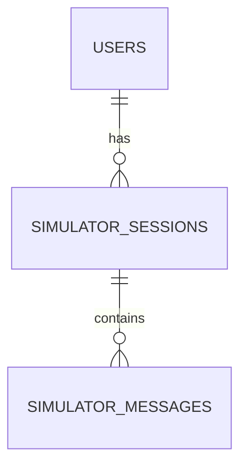

# 数据模型: AI PM 模拟工作流程

本文档定义了为支持 AI PM 模拟工作流程而需要在 Supabase 中创建的实体及其结构。

## 实体关系图



## 1. `simulator_sessions` (模拟会话表)

追踪用户在工作流程模拟中的整体进度。通常一个用户只保留一条活跃的流程记录（也可以选择保留多次尝试，依具体情况定）。

| 字段 | 类型 | 描述 | 验证/约束 |
|---|---|---|---|
| `id` | uuid | 会话的唯一主键 | Primary Key, default gen_random_uuid() |
| `user_id` | uuid | 关联的用户 ID | Foreign Key (auth.users) |
| `current_stage_id` | text | 用户当前进行到的阶段 ID | 不可为空（如 "stage-1-req", "stage-2-design"） |
| `stage_scores` | jsonb | 各个已经完成阶段的得分和 AI 反馈摘要 | 默认为 `{}` |
| `status` | text | 会话的整体状态 | 枚举: `in_progress`, `completed` |
| `created_at` | timestamptz | 会话创建时间 | 默认为当前时间 |
| `updated_at` | timestamptz | 会话最后更新时间 | 每次变动时更新 |

### JSON 结构示例 (`stage_scores`)
```json
{
  "stage-1-req": {
    "score": 85,
    "feedback": "需求拆解逻辑清晰，但缺少了容错机制的考虑。",
    "completed_at": "2026-04-24T10:00:00Z"
  }
}
```

## 2. `simulator_messages` (模拟消息表)

记录用户与虚拟角色（AI）在特定阶段内的交互内容，供重新加载会话时恢复上下文。

| 字段 | 类型 | 描述 | 验证/约束 |
|---|---|---|---|
| `id` | uuid | 消息的唯一主键 | Primary Key |
| `session_id` | uuid | 关联的会话 ID | Foreign Key (simulator_sessions) |
| `stage_id` | text | 产生此消息的阶段 ID | 不可为空 |
| `role` | text | 消息发送方 | 枚举: `user`, `assistant` (甚至 `system` 保存当时的情境提示) |
| `content` | text | 消息内容正文 | 不可为空 |
| `created_at` | timestamptz | 消息产生时间 | 默认为当前时间 |

## 3. 静态领域实体（代码配置，非数据库表）

以下结构在代码中 (`src/lib/simulator-config.ts`) 静态定义。

### `SimulatorStageConfig`

| 字段 | 类型 | 描述 |
|---|---|---|
| `id` | string | 阶段唯一标识符 |
| `title` | string | 阶段名称（如"阶段一：需求澄清"） |
| `description` | string | 阶段背景剧情和任务描述 |
| `order` | number | 流程中的排序（从 1 开始） |
| `npcName` | string | 对话对象的名称（如"业务负责人-老王", "算法专家-小李"） |
| `systemPrompt` | string | 初始化大模型的该角色系统指令 |
| `resources` | array | 该阶段推荐用户阅读的前置书单或文章 |

## 数据约束与状态转换

- **状态转换**: 
  - `status: in_progress` -> 当用户完成最后一个阶段并提交评估后，更新为 `status: completed`。
  - 用户在某个 `stage_id` 提交过关，得到 AI 返回 `{ "passed": true }` 时，前端触发更新会话的 `current_stage_id` 至下一阶段。
- **行级安全 (RLS)**:
  - 只有对应 `user_id` 的用户可以进行 `SELECT`, `INSERT`, `UPDATE`, `DELETE`。
