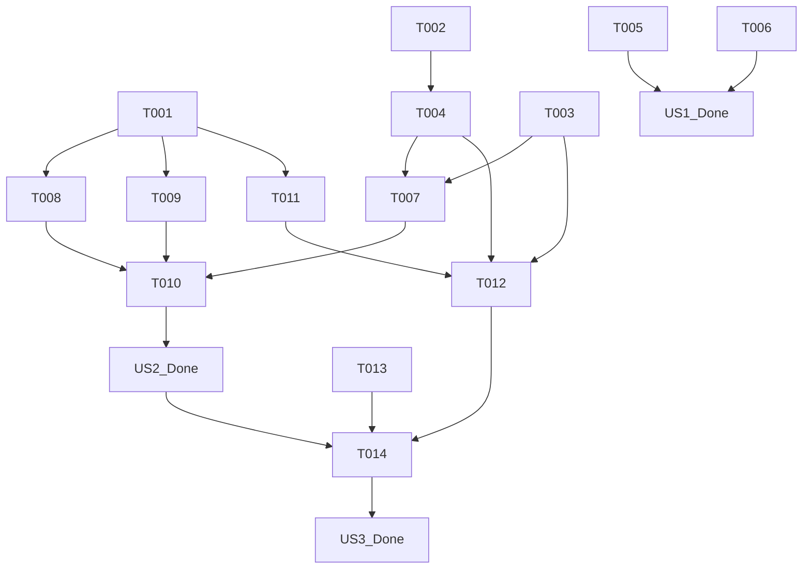

# 实现任务: AI PM 模拟工作流程

**功能**: `001-ai-pm-simulator`
**创建时间**: 2026-04-24

此文档按顺序概述了实现功能的所需任务。任务按用户故事组织, 以确保增量价值交付。

## 阶段 1: 设置与基础设施

建立核心环境和依赖关系。

- [ ] **T001**: 创建静态配置定义 `src/lib/simulator-config.ts` [P]
  - 定义 `SimulatorStageConfig` 接口
  - 定义至少 5 个阶段的静态数据（包含背景、通关目标、资源、`npcName` 和初始的 `systemPrompt`）
- [ ] **T002**: 创建数据库迁移脚本 `supabase/migrations/022_simulator_schema.sql` [P]
  - 编写 `simulator_sessions` 和 `simulator_messages` 表的创建语句
  - 添加针对这两张表的 Row Level Security (RLS) 策略
- [ ] **T003**: 扩展全局类型定义 `src/types/index.ts`
  - 增加模拟进度（`SimulatorSession`）、消息（`SimulatorMessage`）和计分结果的 TypeScript 类型

---

## 阶段 2: 基础准备

在构建用户可见功能之前的阻塞先决条件。

- [ ] **T004**: 执行数据库迁移以应用 `simulator_sessions` 和 `simulator_messages` 表
  - 通过 Supabase 客户端或本地命令运行 `022_simulator_schema.sql`

---

## 阶段 3: 首页与导航栏布局优化 (US1 - P1)

**目标**: 在首页和导航栏中加入新功能的入口，优化顶部导航视觉协调度。
**独立测试标准**: 访问系统时，可以看到顶部导航栏的元素分布更加宽敞协调；在首页能看到新增的进入模拟器入口，且样式适配各种屏幕尺寸。

- [ ] **T005**: 优化顶部导航栏布局 `src/components/layout/Sidebar.tsx` / `Header.tsx` [US1] [P]
  - 增加“AI PM 模拟工作流程”的入口链接
  - 调整顶部元素排版，增加两端（学习平台标识与登录态）的间距
- [ ] **T006**: 增加首页入口卡片 `src/app/page.tsx` [US1]
  - 在原有的“AI PM 笔记本”组件旁，添加一个样式一致的新功能入口卡片
  - 实现悬停动画、圆角和阴影效果匹配现有设计

**[检查点] US1 完成**: 首页入口可见，导航栏布局改进完毕。

---

## 阶段 4: 大厂 AI PM 全流程路线图 (US2 - P1)

**目标**: 提供一个分阶段的流程视图，使用户了解全貌，并能够进入特定阶段学习。
**独立测试标准**: 点击首页入口进入 `/simulator` 路由，系统能够读取/初始化会话进度，并在屏幕上渲染出不同状态（已完成、当前、锁定）的路线图。

- [ ] **T007**: 实现进度 API `src/app/api/simulator/progress/route.ts` [US2] [P]
  - 实现 GET 端点，查询用户的 `simulator_sessions`，如果不存在则返回 404
  - 实现 POST 端点，处理创建新会话（`action: start`）和更新阶段状态/记录分数（`action: complete` / `next_stage`）
- [ ] **T008**: 开发路线图组件 `src/components/simulator/StageRoadmap.tsx` [US2] [P]
  - 基于静态配置和当前进度数据，渲染各个节点的连接和状态展示
- [ ] **T009**: 开发阶段详情面板 `src/components/simulator/StageDetail.tsx` [US2]
  - 展示单个阶段的背景说明、前置阅读资料链接及具体的通关要求
- [ ] **T010**: 集成模拟器主页 `src/app/simulator/page.tsx` [US2]
  - 调用 `GET /api/simulator/progress` 检查状态，如无状态则触发 POST 创建
  - 组合使用 `StageRoadmap` 和 `StageDetail` 组件，提供进入当前未完成阶段的按钮

**[检查点] US2 完成**: 能够成功加载或新建进度，路线图呈现正确。

---

## 阶段 5: AI 角色扮演与交互式任务沟通 (US3 - P1)

**目标**: 提供具体阶段中的聊天互动与最终验收评估功能。
**独立测试标准**: 进入具体阶段页面，能够与设定的 NPC 进行角色扮演对话；提交材料时，AI 能转变为考官模式进行评价打分并决定是否通过。

- [ ] **T011**: 定义系统 Prompt 库 `src/lib/ai/simulator-prompts.ts` [US3] [P]
  - 编写各个 NPC 的指令边界
  - 编写通用的评估提示词（根据不同阶段目标提取 JSON `{ passed: boolean, score: number, feedback: string }`）
- [ ] **T012**: 实现聊天交互 API `src/app/api/simulator/chat/route.ts` [US3] [P]
  - 实现 POST 端点，接收历史消息与用户输入
  - 根据 `is_submission` 标志决定是进行流式对话聊天还是触发静态评估
  - 更新/插入数据到 `simulator_messages`
- [ ] **T013**: 开发聊天交互界面 `src/components/simulator/InteractiveChat.tsx` [US3]
  - 实现消息列表气泡展示、用户输入框
  - 集成流式文本读取能力，支持 Markdown 渲染
  - 提供“提交当前阶段验收”的专用按钮操作
- [ ] **T014**: 开发特定阶段主页 `src/app/simulator/[stageId]/page.tsx` [US3]
  - 整合 `StageDetail`（可折叠）与 `InteractiveChat`
  - 处理对话初始化时拉取本阶段历史 `simulator_messages` 的逻辑
  - 处理提交过关后的逻辑：调用 progress API 更新记录，跳转回 `/simulator`

**[检查点] US3 完成**: 完整的基于角色交互的模拟与打分过关体验闭环。

---

## 阶段 6: 完善与横切关注点

横切所有故事以确保生产准备就绪。

- [ ] **T015**: 异常状态处理与重试机制
  - 处理网络延迟、AI 服务不可用或超时的情况
  - 在前端添加友好的 Toast/Alert 提示
- [ ] **T016**: 跨设备响应式适配
  - 确保聊天界面和路线图在移动端浏览器下布局不拥挤

---

## 依赖关系

## 并行执行示例

如果多名开发者共同参与，任务可以按如下方式并行：

- **开发者 1 (后端/数据库)**: 负责设置数据库表迁移 (T002, T004)，开发进度管理 API (T007) 和对话 API (T012)。
- **开发者 2 (全栈/集成)**: 负责编写 Prompt 库和静态配置 (T001, T011)，并且负责最终页面组合与逻辑串联 (T010, T014)。
- **开发者 3 (前端)**: 并发处理首页布局与导航更新 (T005, T006)，路线图组件开发 (T008, T009)，以及高度互动的聊天面板 UI (T013)。

## 实现策略

1. **核心数据优先**: 首先创建配置文件 `simulator-config.ts` 和模型表，保证后续接口有数据结构可依。
2. **API 前置开发**: 由于 `StageRoadmap` 和 `InteractiveChat` 均高度依赖状态，率先实现 Progress API 和 Chat API 骨架。
3. **UI 和集成解耦**: 聊天交互面板 `InteractiveChat.tsx` 可以独立使用模拟数据进行 UI 开发，之后再与真实的 Stream API 集成。
4. **单路线验证**: 确保基础阶段（如第一关“需求分析”）完全走通包含对话到验收的过程后，再丰富后续阶段的特定人设细节。
